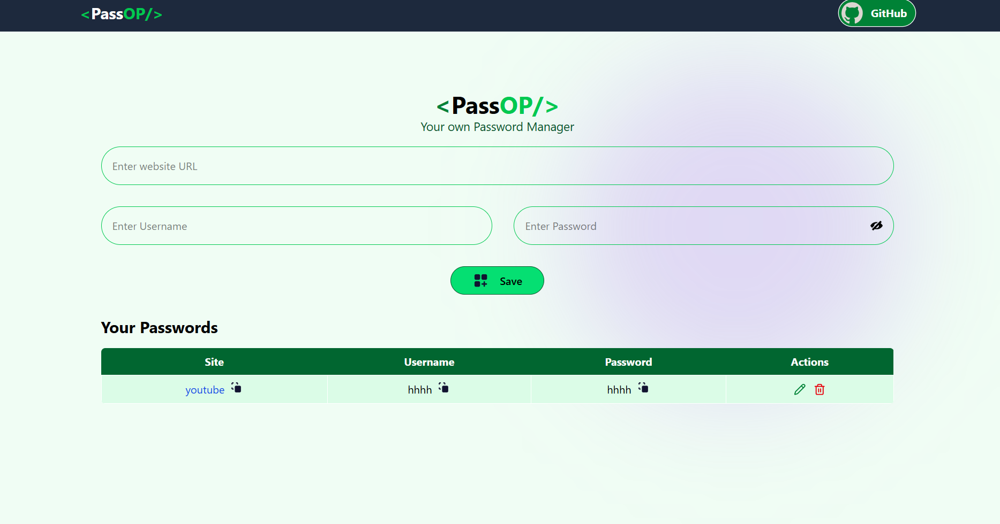
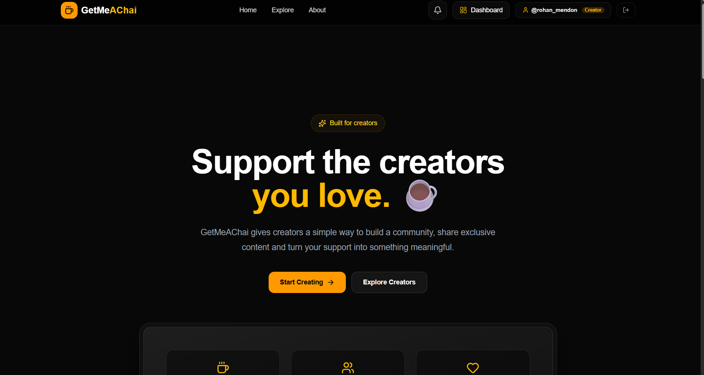
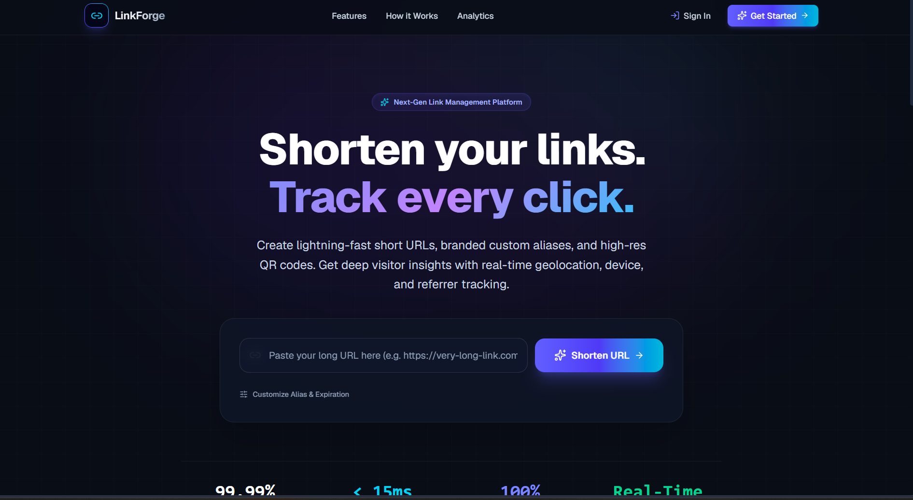

  

<h1 align="center">
  👋 Hi, I'm Rohan Mendon
</h1>

<h3 align="center">
  CSE Student | DSA Enthusiast | Data Science Learner
</h3>

  

---

## 👨‍💻 About Me

I'm a Computer Science Engineering student passionate about building projects, solving problems, and continuously learning new technologies.

- 🎓 3rd Year CSE Student
- 💻 Practicing Data Structures & Algorithms with C++
- 📊 Currently learning Data Science
- 🚀 Building full-stack applications
- 🧠 Interested in problem solving and software development
- 🌱 Always learning and experimenting with new technologies

---

## 🛠️ Tech Stack

### 💻 Languages

  

### 🌐 Web Development

  

### 🗄️ Database

  

### ⚙️ Tools

  

---

## 🚀 Featured Projects

<table>
<tr>

<td width="50%" valign="top">

<h3 align="center">🔐 Password Manager</h3>

  

A full-stack password management application built with React, Node.js, Express and MongoDB.

  

  

  

</td>

<td width="50%" valign="top">

<h3 align="center">☕ GetMeAChai</h3>

  

A creator-support platform inspired by Patreon, featuring authentication, creator profiles, posts, tiers and image uploads.

  

  

  

</td>

</tr>

<tr>

<td width="50%" valign="top">

<h3 align="center">🔗 Link Forge</h3>

  

A modern link management platform for creating, organizing and sharing links through a centralized interface.

  

  

  

</td>

<td width="50%" valign="top">

<h3 align="center">📂 More Projects</h3>

  

Explore my other projects, experiments and coding work on GitHub.

  

</td>

</tr>
</table>

---

## 🏆 Coding Profiles

  🔥 LeetCode 50 Days Badge &nbsp; • &nbsp;
  💻 DSA with C++ &nbsp; • &nbsp;
  🧠 Algorithms & Data Structures

---

## 📊 GitHub Stats

  

  

---

## 🔥 Contribution Streak

  

---

## 🐍 Contribution Graph

  

---

## 🌱 Currently Learning

  

  <b>Data Science • Advanced DSA • Problem Solving • Full Stack Development</b>

---

## 🤝 Let's Connect

---

  ⭐ Thanks for visiting my profile!

  

